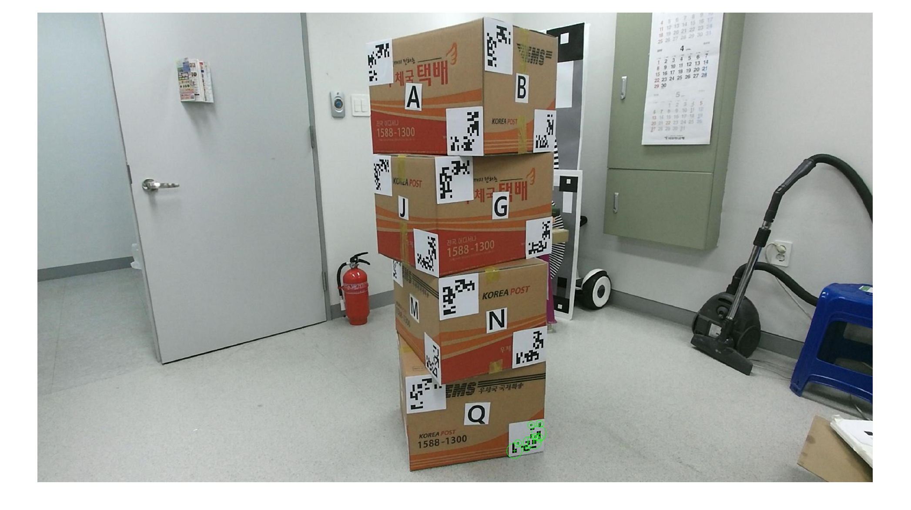
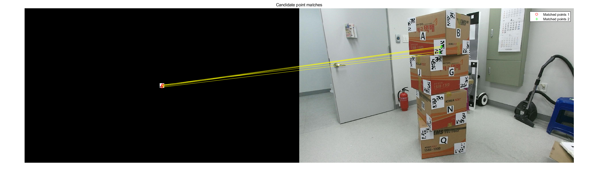

# gtPointGenerator
2D feature detection and generate 3D corresponding points using ground truth object

### Generate 3D corresponding points from 2D images

This is a simple Matlab code to generate 2D - 3D corresponding points of pair. This work is inspired by the paper [2017 CSVT An integrated platform for live 3D human reconstruction and motion capturing](https://vcl.iti.gr/publication/an-integrated-platform-for-live-3d-human-reconstruction-and-motion-capturing/). You can start right away by using a built-in sample image in the code. For the full implementation, this job requires the ground truth box (You should have it in the real-world) and of course, a camera.

### Prerequisions
This code was built in MATLAB R2020b. Also, you need to install the MatLab add-on <Computer Vision Toolbox> for SURF feature detection.

# Tutorial
First, open Run.m and start running. You will see in the console,
```
$ Type filename = <from_current_folder_path> : 
```
Type the image path you want to use. For a quick start, we will use a sample image in the folder.
```
$ Type filename = <from_current_folder_path> : images/Camera.jpg
```
Next, just type `<enter>` for the double size question. This improves accuracy.
```
$ Do you want to Double size? Y/N [Y]: 
```
Now, here comes the image, you should crop AR markers by dragging your mouse.
This will generate SURF feature points inside the region you cropped.



The code will automatically find the best matching AR markers in the built-in dictionary. Just wait for the result.



All you need to do is to decide whether you want to save the detected feature points in the output data.
Type Y to save the detected feature points. Be careful! N (No) is the default.
```
$ Do you want to Save? Y/N [N]: Y
```
And The Console will ask if you want to continue. If you get all of your feature points detected, Type N to finish the process.
If you want to keep detecting feature points, type `<enter>` and re-do your crop & save the process.
```
$ Do you want to continue? Y/N [Y]: 
```
Finally, you can see the console log like this.
You can see `2D&3DPoints.mat` is saved in the directory. 
This data includes the 2D feature points and the corresponding 3D points of Ground Truth Object.
```
2D <-> 3D Correspondence is saved Successfully!
```

# Real Implementation
To calibrate your own camera, you should have a real-world Ground Truth Object. These Objects were built with 4 boxes. The for the detailed manual, go to [2017 CSVT An integrated platform for live 3D human reconstruction and motion capturing](https://vcl.iti.gr/publication/an-integrated-platform-for-live-3d-human-reconstruction-and-motion-capturing/). In this code, the box size can be customized. Change line 46 of `Run.m`. Beware the scale is millimeter.